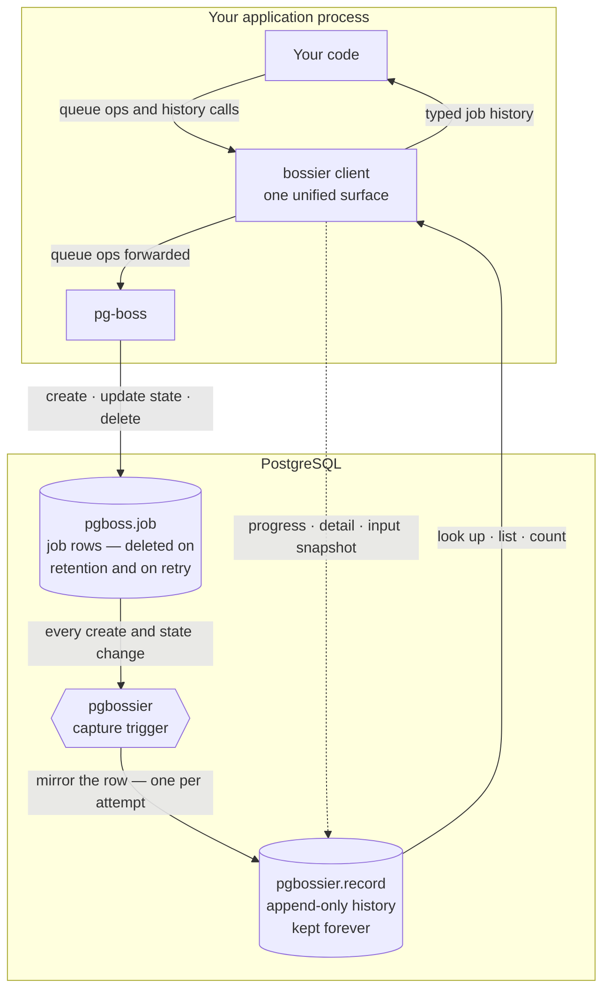

# pg-bossier

[](https://github.com/elfensky/pg-bossier/actions/workflows/ci.yml)

An operational data plane for [pg-boss](https://github.com/timgit/pg-boss) — forensic job history, typed failure detail, retry lineage, mid-job progress, and lifecycle events. pg-bossier **layers on top of** pg-boss: it extends pg-boss, and never replaces it.

> **Status — pre-release.** Not yet published to npm; the package sits at `0.0.0`. Permanent job history and the typed query API work today; typed failure detail, mid-job progress, and lifecycle events are in progress. Per-feature status is in [Features](#features) below; the full scope lives in [issue #1](https://github.com/elfensky/pg-bossier/issues/1).

## Why

pg-boss deletes job rows in place. Once a job finishes and its retention window passes, the row is gone; a retried job is `DELETE`+`INSERT`ed under the same id. That makes "what happened to job X six months ago?" unanswerable. pg-bossier installs one trigger that copies every state transition into an append-only table you own, so the history outlives pg-boss's cleanup.

## Features

pg-bossier is nine concrete capabilities — the goals tracked in [issue #1](https://github.com/elfensky/pg-bossier/issues/1). Status: ✅ available today · 🟡 in progress · ⬜ planned.

| Capability | What you get | Status |
| --- | --- | --- |
| **Permanent job history** | Every job and every state change kept forever — answerable even after pg-boss has deleted the original row. | ✅ |
| **Typed query API** | Typed methods to look jobs up, list and filter them, and count them by state or queue — no hand-written SQL. | ✅ |
| **Retry history** | Every attempt of a retried job preserved as its own record, with one method for the full ordered history. | ✅ |
| **One-step install, clean uninstall** | Adoption is one dependency and one migration; removal drops a single schema and leaves pg-boss untouched. | ✅ |
| **pg-boss compatibility contract** | A documented tier system naming which pg-boss surfaces pg-bossier depends on and how stable each is. | ✅ |
| **Typed failure detail** | A structured, queryable reason for every finished job — with a temporary-vs-permanent label on failures. | ✅ |
| **Input snapshots** | An optional slot to record what data a job saw when it ran, so its inputs stay recoverable. | ✅ |
| **Mid-job progress** | A progress value a worker updates while a job runs, surviving crashes and retries. | 🟡 |
| **Lifecycle events** | Subscribe to job state changes as they happen, instead of polling for them. | ⬜ |

🟡 capabilities are partly usable now — the storage that backs them works today, while their typed APIs are still being designed.

## How it works

pg-bossier gives you a single client that wraps pg-boss: you call queue operations on it just as you would on pg-boss, and pg-bossier's own methods sit right alongside them. The job history is captured separately, inside PostgreSQL — by a database trigger, not by the client:



1. **Your app runs jobs through the `bossier` client.** It forwards every pg-boss queue operation to pg-boss unchanged — pg-bossier extends pg-boss's API, it never replaces it.
2. **pg-boss manages its own `pgboss.job` table** — creating rows, updating their state, and deleting them once a retention window passes or a retry replaces them.
3. **A capture trigger mirrors every change.** Each time a job is created or changes state, pg-bossier copies that row into its own `pgbossier.record` table — one row per attempt, so retries are preserved rather than overwritten.
4. **The history outlives pg-boss's cleanup.** When pg-boss deletes a job row, `pgbossier.record` is left untouched — the history stays.
5. **You read history through the `bossier` client.** Its query methods only ever read `pgbossier.record`, so they keep answering long after the original `pgboss.job` row is gone.

The capture is fail-open: if it ever errors, the failure is logged and skipped — it never blocks the pg-boss operation that triggered it.

## Requirements

- Node.js ≥ 18
- [pg-boss](https://github.com/timgit/pg-boss) 12 (`^12.18.2`) — peer dependency
- [`pg`](https://node-postgres.com/) 8 (`^8`) — peer dependency
- PostgreSQL, as required by pg-boss 12

## Install

pg-bossier is a Postgres add-on to [pg-boss](https://github.com/timgit/pg-boss).
Install it via npm and run the install step once against your database.

### From a git URL (pre-publish)

Until v0.1.0 is on npm, install pg-bossier directly from a tagged commit:

```bash
npm install git+https://github.com/elfensky/pg-bossier#<commit-sha>
```

Always pin to a specific commit SHA rather than a branch — branch refs
in `package-lock.json` re-resolve to the branch head on every `npm ci`,
which makes builds non-reproducible.

### Programmatic install

```ts
import { Pool } from 'pg';
import { install } from 'pg-bossier';

const pool = new Pool({ connectionString: process.env.DATABASE_URL });
await install(pool);  // creates the pgbossier schema, table, trigger, etc.

// Later:
import { uninstall } from 'pg-bossier';
await uninstall(pool);  // DROP SCHEMA pgbossier CASCADE
```

`install()` is idempotent. Run it once at app boot or in a one-shot
migration script.

### CLI install (optional)

For ops contexts or CI/CD pipelines where wiring a Node script is
awkward:

```bash
npx pg-bossier install   --conn-string="$DATABASE_URL"
npx pg-bossier uninstall --conn-string="$DATABASE_URL"
```

The CLI prints the destination (`host=… database=… schema=…`) before
running any SQL so you can confirm the right database is being changed.

### Schema configuration

By default, pg-bossier installs into the `pgbossier` schema and triggers
on `pgboss.job`. Override either name:

```ts
await install(pool, {
  schema:       'altbossier',     // pg-bossier's own schema
  pgbossSchema: 'altpgboss',      // pg-boss source schema
});
```

The same options propagate to the client:

```ts
const client = bossier({ boss, pool, schema: 'altbossier' });
```

### Prisma coexistence ⚠️

> **⚠️ If you use Prisma with `multiSchema` preview, you MUST exclude
> the `pgbossier` schema from your `datasource.schemas` list.**
>
> `prisma db pull` with `multiSchema` introspects all schemas including
> pgbossier. Running `prisma migrate dev` against the resulting schema
> would try to drop or migrate pg-bossier's tables — destructive
> failure.

For standard (non-`multiSchema`) Prisma usage: `prisma migrate` only
manages schemas declared in your Prisma datasource. pgbossier is not
declared there, so Prisma doesn't see it. `install(pool)` is
idempotent; safe to run on every deploy.

### Supported topologies

| pg-bossier schemas | pg-boss schemas | Status |
|---|---|---|
| 1 | 1 (default) | ✅ Supported (common case) |
| N distinct | N distinct | ✅ Supported (full isolation) |
| 2 distinct | 1 shared | ❌ Unsupported (duplicate captures) |
| 1 | N distinct | ❌ Unsupported (one instance, one source) |

## Usage

```ts
import { PgBoss } from 'pg-boss';
import pg from 'pg';
import { install, bossier } from 'pg-bossier';

const connectionString = process.env.DATABASE_URL!;

// 1. One-time install. Creates the `pgbossier` schema, the `record` chronicle
//    table, and a capture trigger on `pgboss.job`, then backfills existing
//    jobs. Idempotent — safe to run on every boot or as a migration step.
const pool = new pg.Pool({ connectionString });
await install(pool);

// 2. Start pg-boss exactly as you already do — pg-bossier changes nothing here.
const boss = new PgBoss(connectionString);
await boss.start();

// 3. Wrap it. `client` is one surface — every pg-boss method plus pg-bossier's
//    own; from here on, each job state transition is mirrored into
//    `pgbossier.record` and kept forever.
const client = bossier({ boss, pool });

await client.createQueue('email');
await client.send('email', { to: 'user@example.com' });
```

### Reading job history

The `bossier` client exposes typed read methods over `pgbossier.record`. Because that table outlives pg-boss's row deletion, they answer operational questions long after the `pgboss.job` row is gone:

```ts
// the latest attempt of one job — null if unknown
const job = await client.findById(jobId);

// every attempt of a retried job, oldest first
const attempts = await client.getRetryHistory(jobId);

// a filtered, paginated page, with an exact total
const { rows, total } = await client.listJobs({
  queue: 'email',
  states: ['failed'],
  limit: 50,
});

// job counts grouped by current state, or by queue
const byState = await client.countByState({ queue: 'email' });
const byQueue = await client.countByQueue();

// the most recently created job in each queue
const latest = await client.latestPerQueue(['email', 'reports']);

// active jobs running longer than a threshold (default 900s)
const stalled = await client.listLongRunning({ longerThanSeconds: 600 });
```

### Writing pg-bossier-owned columns

`recordPatch` writes the columns the capture trigger leaves for the application — currently `input_snapshot`. It targets a single attempt, keyed by job id and attempt number (pg-boss's `retry_count` — `0` on the first try):

```ts
await client.recordPatch(jobId, 0, { input_snapshot: { userId: 42 } });
```

The typed write API for `input_snapshot` (Goal 4) is `recordInputSnapshot` — see [Recording input snapshots](#recording-input-snapshots). `terminal_detail` has its own dedicated writer — see [Recording terminal detail](#recording-terminal-detail).

### Recording terminal detail

After a worker finishes a job, pg-bossier lets you classify the outcome with structured detail. The `recordTerminalDetail` method writes a typed shape into the audit row's `terminal_detail` JSONB column.

```ts
import { bossier } from 'pg-bossier';
const client = bossier({ boss, pool });

// Inside a worker handler:
try {
  // ... do work ...
  await boss.complete(jobId, output);
  await client.recordTerminalDetail(jobId, attempt, {
    state: 'completed',
    detail: { duration_ms: 42 },
  });
} catch (err) {
  await boss.fail(jobId, err);
  await client.recordTerminalDetail(jobId, attempt, {
    state: 'failed',
    detail: {
      class: isRateLimit(err) ? 'transient' : 'non_retryable',
      message: String(err),
    },
  });
}
```

#### Shape

`terminal_detail` is discriminated by row `state`:

- `state: 'failed'` → `{ class: 'transient' | 'non_retryable', message?, where?, ...anything else }`. The `class` field is required. If you don't know, default to `'non_retryable'` (conservative: gives up rather than spinning) and put the reason in `message`.
- `state: 'cancelled'` → `{ cancelledBy?, reason? }` (open).
- `state: 'completed'` → any plain object (no shape enforcement).

#### Retry interaction

If pg-boss is going to retry the job, the row at `(jobId, attempt)` transitions through `state='retry'`. `recordTerminalDetail` writes `state: 'failed'` regardless — the SQL writer maps `'failed'` to the allowed row states `['failed', 'retry']`. The detail stays attached to the original attempt's chronicle row.

#### Upgrading to Goal 2 from earlier 0.x

If you used `recordPatch` to write `terminal_detail` before Goal 2 shipped, run:

```sql
UPDATE pgbossier.record SET terminal_detail = NULL;
```

or `DROP SCHEMA pgbossier CASCADE` and reinstall. The new typed reader assumes `terminal_detail` rows conform to the discriminated union; legacy shapes would be silently misread. Per pg-bossier's `0.x` API instability policy, this manual step is acceptable.

`recordPatch` no longer accepts a `terminal_detail` field — TypeScript rejects it at compile time.

### Recording dead-letter lineage

When pg-boss exhausts a job's retries, it routes the failure to a separate dead-letter queue (DLQ) — a fresh job with a new id and no link back to the source. Once the source's `pgboss.job` row is gone, the DLQ entry is an orphan. pg-bossier closes that gap with one call: from your DLQ handler, record the source→DLQ link, and you can reach the full source history from a DLQ id forever after.

pg-bossier cannot derive the source id from the DLQ job — pg-boss does not carry it forward. Establishing the link is a cooperative effort: the consumer preserves the source id on its own data; pg-bossier persists the link and exposes both directions of lookup.

#### The `_originalJobId` consumer contract

The DLQ-handler is responsible for preserving the source id by setting it on the source job's `data` payload **before** calling `boss.send()`. Convention:

```ts
// when sending the original job
await boss.send('image-processing', {
  _originalJobId: crypto.randomUUID(),  // self-identifying field
  // ...your real payload
  url: 'https://example.com/photo.jpg',
});
```

Then, in the DLQ handler, that same field is what you hand to `recordDeadLetter`:

```ts
boss.work('image-processing.dlq', async (job) => {
  await client.recordDeadLetter({
    sourceJobId: job.data._originalJobId,
    dlqJobId: job.id,
  });
  // ...your DLQ-specific recovery logic...
});
```

This is a **named, surface-level requirement**, not a buried convention. Without `_originalJobId` (or an equivalent field name) on the source job's `data`, the DLQ handler has nothing to give `recordDeadLetter`, and the lineage cannot be recorded. Use any field name you like — `_originalJobId` is just the convention this README uses in examples.

#### Round-trip example

```ts
// 1. Send the source job, self-identifying.
const sourceId = crypto.randomUUID();
await boss.send('image-processing', { _originalJobId: sourceId, url: '...' });

// 2. The worker runs and fails terminally. The capture trigger writes the
//    source's chronicle row with state='failed'. pg-boss routes a fresh job
//    into the DLQ.

// 3. The DLQ handler picks up the DLQ job and records the link.
boss.work('image-processing.dlq', async (job) => {
  await client.recordDeadLetter({
    sourceJobId: job.data._originalJobId,
    dlqJobId: job.id,
  });
});

// 4. Later, in a forensic UI: reach the source from a DLQ id.
const source = await client.findDeadLetterSource(dlqJobId);
// → { jobId: '<sourceId>', attempt: <n>, queue: 'image-processing' }
//   or null if no link was recorded.
const history = await client.getRetryHistory(source.jobId);
// every attempt of the source, including inputs, outputs, terminal_detail.

// 5. Forward direction (source → DLQ).
const target = await client.findDeadLetterTarget(sourceId);
// → { dlqJobId: '<id>', attempt: <n> } or null.
```

#### Idempotency contract

Calling `recordDeadLetter` twice with the same `(sourceJobId, dlqJobId)` is idempotent — the same merged value lands on the source's row. Calling with a *different* `dlqJobId` for the same source is a no-op — the first link wins, and a warning is logged. This prevents a buggy handler that regenerates DLQ ids on retry from silently overwriting an established link.

If the source has no `failed` row at all (wrong id, never reached `failed`, source row purged), the call is also a silent no-op with a warning log carrying `reason: 'not_found'`.

#### Composition with `recordTerminalDetail`

`recordDeadLetter` and Goal 2's `recordTerminalDetail` cooperate at the key level inside the `terminal_detail` JSONB column. Either call order produces the merged shape `{ class, message, deadLetteredAs, ... }` — the writers JSONB-merge into the same row, so neither one wipes out the other's fields.

#### When to call it

`recordDeadLetter` only writes when the source's most-recent chronicle row is in `state = 'failed'`. It silently no-ops if the source is still in `state = 'retry'` between attempts — call it from the DLQ-handler (which runs *after* pg-boss has committed the terminal failure), not from a mid-retry worker callback. The DLQ handler is the only place that has both the source id (from `_originalJobId`) and the DLQ id (from `job.id`) at the same time anyway.

#### What does NOT change

- **`progress` (Goal 6) is not copied source → DLQ.** The DLQ job starts with no progress; its chronicle entries are its own. The source job's `progress` history stays on the source's rows and is reachable through `findDeadLetterSource` + `getProgress`.
- **`boss.retry(dlqJobId)` (the SQS-redrive analogue) does not disturb the existing `deadLetteredAs` link.** The DLQ job gets a new attempt; its `pgbossier.record` row gets a new attempt row via the capture trigger; the existing link on the *source* job's row is unaffected.

### Recording input snapshots

A job's `data` payload is what the producer queued. That is not always what the worker actually processed: many jobs go fetch additional state from somewhere else (an HTTP API, another database, the filesystem) at the moment they start, and the meaningful "input" to the run is that fetched state — not the original payload. Once the external source has moved on, the row in `pgboss.job` is deleted, and the worker process is long gone, that information is unrecoverable. The input-snapshot slot is an opt-in JSONB column on `pgbossier.record` for the worker to write a snapshot of what it saw, keyed by `(jobId, attempt)`, so months later you can answer "what data did this job actually process?"

#### ⚠️ Call at job-START, not job-FINISH

`recordInputSnapshot` is for **inputs**, not outputs. Call it at the top of the worker handler — right after you fetch the external state and before you start processing — so the snapshot records what the job *saw on the way in*. If you call it at the end with computed results, you have destroyed the feature: you are recording the output as if it were the input, and the audit trail is wrong in a way that is hard to detect later.

For outputs, use pg-boss's existing `boss.complete(jobId, output)` — pg-boss persists outputs to `pgboss.job.output`, and the capture trigger mirrors that into `pgbossier.record.output` for you.

#### Worker-side example

```ts
boss.work('space-track-fetch', async (job) => {
  // 1. Fetch the external state this attempt will operate on.
  const snapshot = await spaceTrack.fetch({
    catalogId: job.data.catalogId,
    epoch: job.data.epoch,
  });

  // 2. Record it as the input snapshot for THIS attempt. attempt is
  //    pg-boss's retry_count — 0 on the first try.
  await client.recordInputSnapshot(job.id, job.retryCount, snapshot);

  // 3. Do the work using the snapshot. If this attempt fails and pg-boss
  //    retries, the next attempt fetches a fresh snapshot and records its
  //    own — both stay in the audit trail under the same job id.
  const result = await process(snapshot);
  await boss.complete(job.id, result);
});
```

#### Reader: two modes

Read by `(jobId, attempt)` for a specific attempt, or by `jobId` alone for the most-recent non-null snapshot across attempts. The two modes return different shapes:

```ts
// Explicit attempt — returns T | null.
const snap = await client.getInputSnapshot<SpaceTrackPayload>(jobId, 0);
// → the snapshot value, or null if that (jobId, attempt) has no snapshot.

// Most-recent across attempts — returns { snapshot, attempt } | null.
const result = await client.getInputSnapshot<SpaceTrackPayload>(jobId);
// → { snapshot: <value>, attempt: 2 }
//   or null if the job has no snapshot on any attempt.
```

The exported type is `InputSnapshotResult<T>`:

```ts
import type { InputSnapshotResult } from 'pg-bossier';
// { snapshot: T; attempt: number }
```

#### `recordPatch` vs `recordInputSnapshot`

Use `recordInputSnapshot` for normal worker-start capture — it validates the snapshot is non-null and JSON-serializable, and is the writer the typed API is built around. Use `recordPatch({ input_snapshot: null })` for the one case `recordInputSnapshot` cannot express: explicitly clearing a previously-written snapshot back to SQL NULL. Both writers target the same column and last-write wins.

#### Size

The column is unbounded. PostgreSQL TOASTs large JSONB transparently, so a one-megabyte snapshot is mechanically fine — but `pgbossier.record` grows forever, and unbounded snapshots multiply your storage cost (≈$0.10/GB/month on most cloud providers), make `findById` projections heavier than they would otherwise be, and bloat backups. Snapshot what is forensically useful, not the whole upstream response. Compression is consumer-owned (TOAST handles large values; pg-bossier does not pre-compress).

#### Index migration note for large existing installs

`install()` issues a plain `CREATE INDEX IF NOT EXISTS record_input_snapshot_gin ... USING gin (input_snapshot)`. That is fine for fresh installs and for upgrades on small/medium tables. On a `pgbossier.record` table that already holds millions of rows, the index build will hold an ACCESS EXCLUSIVE lock long enough to stall capture writes. Pre-create the index concurrently *before* you call `install()`:

```sql
CREATE INDEX CONCURRENTLY record_input_snapshot_gin
  ON pgbossier.record USING gin (input_snapshot);
```

Then run `install()` — the `IF NOT EXISTS` clause sees the index already present and skips it.

#### What does NOT change

- **`recordPatch({ input_snapshot: ... })` still works.** The two writers coexist; `recordInputSnapshot` is the typed front door, `recordPatch` is the lower-level path that also handles explicit clearing.
- **The GIN index is added on install/upgrade transparently.** No action needed for small/medium installs.
- **The capture trigger is unchanged.** It has never touched `input_snapshot` (the column is pgbossier-owned, not pg-boss-mirrored) and that stays true.

### Job progress

`setProgress` writes a job's current progress to its active attempt. A worker only needs `job.id` — the target attempt is resolved server-side. Pass any JSON-serializable value: a structured object, a bare string, a number. The call is fail-open: a runtime error logs a warning and resolves without throwing, so a failed progress write never fails the consumer's job. Progress values survive pg-boss retries — each attempt has its own row, so a prior attempt's final checkpoint remains readable even after the job has been retried.

```ts
// inside a pg-boss work() handler
await client.setProgress(job.id, { processed: 1200, total: 5000 });
```

`getProgress` returns the most-recent non-null progress value across all attempts, plus the attempt it came from. Returns `null` if the job is unknown or no attempt has written progress yet.

```ts
const result = await client.getProgress(jobId);
// { progress: { processed: 1200, total: 5000 }, attempt: 0 }
// or null

// typed variant
const typed = await client.getProgress<{ processed: number; total: number }>(jobId);
```

The returned `attempt` is useful for the resumable-job pattern: a new attempt's row starts `null`, so if `getProgress` returns a value whose `attempt` is lower than the current attempt, it is a prior attempt's final checkpoint to resume from. A display-only job can ignore the `attempt` field.

The exported type is `ProgressResult<TProgress>`:

```ts
import type { ProgressResult } from 'pg-bossier';
// { progress: TProgress; attempt: number }
```

### Lifecycle events (Goal 7)

Subscribe to job state transitions instead of polling:

```ts
import { bossier } from 'pg-bossier';

const client = bossier({ boss, pool });
const events = await client.subscribe();
let lastSeq = 0n;

events.on('connected', () => console.log('event stream live'));
events.on('failed', e => console.warn(`job ${e.jobId} failed on attempt ${e.attempt}`));
events.on('job', e => { lastSeq = e.seq; });
events.on('error', async e => {
  if (e.reason === 'gap') {
    const missed = await client.getEventsSince(lastSeq);
    for (const row of missed) { lastSeq = row.seq; handleCatchUp(row); }
  }
});

process.on('SIGINT', async () => {
  await events.close();
  await boss.stop();
});
```

**Event types.** `'created'`, `'started'`, `'completed'`, `'failed'`, `'cancelled'`, `'retried'`. Catch-all `'job'`. Subscriber-level `'connected'` (every successful LISTEN), `'warning'` (first occurrence of an unknown pg-boss state), `'error'` (`reason: 'gap' | 'parse' | 'handler'`).

**Delivery contract.** At most once. On a connection drop the subscriber auto-reconnects with exponential backoff + jitter and emits `'error'` with `reason: 'gap'`. Durable replay via `getEventsSince(seq)`. **Important scope:** the audit table holds the final state per attempt, not the full transition sequence within an attempt — `getEventsSince` recovers latest-state-per-attempt only.

**`attempt` semantics.** `created` carries `0` for a freshly-sent job. `started`/`completed`/`failed`/`cancelled` carry the attempt number that was active when the transition happened. `retried` fires when an attempt fails but a retry remains — it carries the FAILING attempt's number (the OLD one). The NEXT attempt's `started` event carries the new attempt number (e.g. `1`). **No `'created'` event fires for retried attempts** — pg-boss's `fetchNextJob` bumps `retry_count` and sets `state='active'` in a single UPDATE, so the retry row goes directly to `started(N+1)`.

For a job that fails once and then succeeds (retryLimit = 1), the consumer sees five events:
`created(0)` → `started(0)` → `retried(0)` → `started(1)` → `completed(1)`.

**Connection cost.** Each live subscriber holds one dedicated pool connection. Size your pool accordingly. For long-running processes only (web servers, workers) — not lambdas / FaaS.

**Unsupported topologies.** PgBouncer in transaction-pool mode silently breaks `LISTEN`. Use session-pool mode, a direct Postgres connection, or skip PgBouncer for the subscriber's connection. See [`COMPATIBILITY.md`](./COMPATIBILITY.md).

**MaxListenersExceededWarning.** If you add many `'job'` listeners (e.g. for metrics fan-out), call `events.setMaxListeners(0)` to suppress Node's 10-listener default warning.

### Uninstall

Removal is symmetric — one statement drops everything pg-bossier created and leaves `pgboss.job` untouched:

```ts
import { uninstall } from 'pg-bossier';

await uninstall(pool); // DROP SCHEMA pgbossier CASCADE
```

## pg-boss compatibility

pg-bossier classifies every pg-boss surface it touches as Stable, Transitional, or Forbidden — see [`COMPATIBILITY.md`](./COMPATIBILITY.md).

## Versioning

[Semantic Versioning](https://semver.org/). While on `0.x` the API is unstable — anything may change between minor versions. Changes are recorded in [`CHANGELOG.md`](./CHANGELOG.md).

## License

[MIT](./LICENSE) © Andrei Lavrenov
