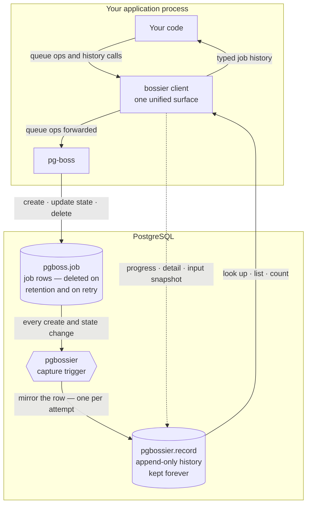

# pg-bossier

[](https://github.com/elfensky/pg-bossier/actions/workflows/ci.yml)

An operational data plane for [pg-boss](https://github.com/timgit/pg-boss) — forensic job history, typed failure detail, retry lineage, mid-job progress, and lifecycle events. pg-bossier **layers on top of** pg-boss: it extends pg-boss, and never replaces it.

> **Status — pre-release.** Not yet published to npm; the package sits at `0.0.0`. Permanent job history and the typed query API work today; typed failure detail, mid-job progress, and lifecycle events are in progress. Per-feature status is in [Features](#features) below; the full scope lives in [issue #1](https://github.com/elfensky/pg-bossier/issues/1).

## Why

pg-boss deletes job rows in place. Once a job finishes and its retention window passes, the row is gone; a retried job is `DELETE`+`INSERT`ed under the same id. That makes "what happened to job X six months ago?" unanswerable. pg-bossier installs one trigger that copies every state transition into an append-only table you own, so the history outlives pg-boss's cleanup.

## Features

pg-bossier is nine concrete capabilities — the goals tracked in [issue #1](https://github.com/elfensky/pg-bossier/issues/1). Status: ✅ available today · 🟡 in progress · ⬜ planned.

| Capability | What you get | Status |
| --- | --- | --- |
| **Permanent job history** | Every job and every state change kept forever — answerable even after pg-boss has deleted the original row. | ✅ |
| **Typed query API** | Typed methods to look jobs up, list and filter them, and count them by state or queue — no hand-written SQL. | ✅ |
| **Retry history** | Every attempt of a retried job preserved as its own record, with one method for the full ordered history. | ✅ |
| **One-step install, clean uninstall** | Adoption is one dependency and one migration; removal drops a single schema and leaves pg-boss untouched. | ✅ |
| **pg-boss compatibility contract** | A documented tier system naming which pg-boss surfaces pg-bossier depends on and how stable each is. | ✅ |
| **Typed failure detail** | A structured, queryable reason for every finished job — with a temporary-vs-permanent label on failures. | 🟡 |
| **Input snapshots** | An optional slot to record what data a job saw when it ran, so its inputs stay recoverable. | 🟡 |
| **Mid-job progress** | A progress value a worker updates while a job runs, surviving crashes and retries. | 🟡 |
| **Lifecycle events** | Subscribe to job state changes as they happen, instead of polling for them. | ⬜ |

🟡 capabilities are partly usable now — the storage that backs them works today, while their typed APIs are still being designed.

## How it works

pg-bossier gives you a single client that wraps pg-boss: you call queue operations on it just as you would on pg-boss, and pg-bossier's own methods sit right alongside them. The job history is captured separately, inside PostgreSQL — by a database trigger, not by the client:



1. **Your app runs jobs through the `bossier` client.** It forwards every pg-boss queue operation to pg-boss unchanged — pg-bossier extends pg-boss's API, it never replaces it.
2. **pg-boss manages its own `pgboss.job` table** — creating rows, updating their state, and deleting them once a retention window passes or a retry replaces them.
3. **A capture trigger mirrors every change.** Each time a job is created or changes state, pg-bossier copies that row into its own `pgbossier.record` table — one row per attempt, so retries are preserved rather than overwritten.
4. **The history outlives pg-boss's cleanup.** When pg-boss deletes a job row, `pgbossier.record` is left untouched — the history stays.
5. **You read history through the `bossier` client.** Its query methods only ever read `pgbossier.record`, so they keep answering long after the original `pgboss.job` row is gone.

The capture is fail-open: if it ever errors, the failure is logged and skipped — it never blocks the pg-boss operation that triggered it.

## Requirements

- Node.js ≥ 18
- [pg-boss](https://github.com/timgit/pg-boss) 12 (`^12.18.2`) — peer dependency
- [`pg`](https://node-postgres.com/) 8 (`^8`) — peer dependency
- PostgreSQL, as required by pg-boss 12

## Install

pg-bossier is a Postgres add-on to [pg-boss](https://github.com/timgit/pg-boss).
Install it via npm and run the install step once against your database.

### From a git URL (pre-publish)

Until v0.1.0 is on npm, install pg-bossier directly from a tagged commit:

```bash
npm install git+https://github.com/elfensky/pg-bossier#<commit-sha>
```

Always pin to a specific commit SHA rather than a branch — branch refs
in `package-lock.json` re-resolve to the branch head on every `npm ci`,
which makes builds non-reproducible.

### Programmatic install

```ts
import { Pool } from 'pg';
import { install } from 'pg-bossier';

const pool = new Pool({ connectionString: process.env.DATABASE_URL });
await install(pool);  // creates the pgbossier schema, table, trigger, etc.

// Later:
import { uninstall } from 'pg-bossier';
await uninstall(pool);  // DROP SCHEMA pgbossier CASCADE
```

`install()` is idempotent. Run it once at app boot or in a one-shot
migration script.

### CLI install (optional)

For ops contexts or CI/CD pipelines where wiring a Node script is
awkward:

```bash
npx pg-bossier install   --conn-string="$DATABASE_URL"
npx pg-bossier uninstall --conn-string="$DATABASE_URL"
```

The CLI prints the destination (`host=… database=… schema=…`) before
running any SQL so you can confirm the right database is being changed.

### Schema configuration

By default, pg-bossier installs into the `pgbossier` schema and triggers
on `pgboss.job`. Override either name:

```ts
await install(pool, {
  schema:       'altbossier',     // pg-bossier's own schema
  pgbossSchema: 'altpgboss',      // pg-boss source schema
});
```

The same options propagate to the client:

```ts
const client = bossier({ boss, pool, schema: 'altbossier' });
```

### Prisma coexistence ⚠️

> **⚠️ If you use Prisma with `multiSchema` preview, you MUST exclude
> the `pgbossier` schema from your `datasource.schemas` list.**
>
> `prisma db pull` with `multiSchema` introspects all schemas including
> pgbossier. Running `prisma migrate dev` against the resulting schema
> would try to drop or migrate pg-bossier's tables — destructive
> failure.

For standard (non-`multiSchema`) Prisma usage: `prisma migrate` only
manages schemas declared in your Prisma datasource. pgbossier is not
declared there, so Prisma doesn't see it. `install(pool)` is
idempotent; safe to run on every deploy.

### Supported topologies

| pg-bossier schemas | pg-boss schemas | Status |
|---|---|---|
| 1 | 1 (default) | ✅ Supported (common case) |
| N distinct | N distinct | ✅ Supported (full isolation) |
| 2 distinct | 1 shared | ❌ Unsupported (duplicate captures) |
| 1 | N distinct | ❌ Unsupported (one instance, one source) |

## Usage

```ts
import { PgBoss } from 'pg-boss';
import pg from 'pg';
import { install, bossier } from 'pg-bossier';

const connectionString = process.env.DATABASE_URL!;

// 1. One-time install. Creates the `pgbossier` schema, the `record` chronicle
//    table, and a capture trigger on `pgboss.job`, then backfills existing
//    jobs. Idempotent — safe to run on every boot or as a migration step.
const pool = new pg.Pool({ connectionString });
await install(pool);

// 2. Start pg-boss exactly as you already do — pg-bossier changes nothing here.
const boss = new PgBoss(connectionString);
await boss.start();

// 3. Wrap it. `client` is one surface — every pg-boss method plus pg-bossier's
//    own; from here on, each job state transition is mirrored into
//    `pgbossier.record` and kept forever.
const client = bossier({ boss, pool });

await client.createQueue('email');
await client.send('email', { to: 'user@example.com' });
```

### Reading job history

The `bossier` client exposes typed read methods over `pgbossier.record`. Because that table outlives pg-boss's row deletion, they answer operational questions long after the `pgboss.job` row is gone:

```ts
// the latest attempt of one job — null if unknown
const job = await client.findById(jobId);

// every attempt of a retried job, oldest first
const attempts = await client.getRetryHistory(jobId);

// a filtered, paginated page, with an exact total
const { rows, total } = await client.listJobs({
  queue: 'email',
  states: ['failed'],
  limit: 50,
});

// job counts grouped by current state, or by queue
const byState = await client.countByState({ queue: 'email' });
const byQueue = await client.countByQueue();

// the most recently created job in each queue
const latest = await client.latestPerQueue(['email', 'reports']);

// active jobs running longer than a threshold (default 900s)
const stalled = await client.listLongRunning({ longerThanSeconds: 600 });
```

### Writing pg-bossier-owned columns

`recordPatch` writes the columns the capture trigger leaves for the application — `terminal_detail` and `input_snapshot`. It targets a single attempt, keyed by job id and attempt number (pg-boss's `retry_count` — `0` on the first try):

```ts
await client.recordPatch(jobId, 0, { input_snapshot: { userId: 42 } });
```

The typed write APIs for these columns land with Goals 2 and 4.

### Job progress

`setProgress` writes a job's current progress to its active attempt. A worker only needs `job.id` — the target attempt is resolved server-side. Pass any JSON-serializable value: a structured object, a bare string, a number. The call is fail-open: a runtime error logs a warning and resolves without throwing, so a failed progress write never fails the consumer's job. Progress values survive pg-boss retries — each attempt has its own row, so a prior attempt's final checkpoint remains readable even after the job has been retried.

```ts
// inside a pg-boss work() handler
await client.setProgress(job.id, { processed: 1200, total: 5000 });
```

`getProgress` returns the most-recent non-null progress value across all attempts, plus the attempt it came from. Returns `null` if the job is unknown or no attempt has written progress yet.

```ts
const result = await client.getProgress(jobId);
// { progress: { processed: 1200, total: 5000 }, attempt: 0 }
// or null

// typed variant
const typed = await client.getProgress<{ processed: number; total: number }>(jobId);
```

The returned `attempt` is useful for the resumable-job pattern: a new attempt's row starts `null`, so if `getProgress` returns a value whose `attempt` is lower than the current attempt, it is a prior attempt's final checkpoint to resume from. A display-only job can ignore the `attempt` field.

The exported type is `ProgressResult<TProgress>`:

```ts
import type { ProgressResult } from 'pg-bossier';
// { progress: TProgress; attempt: number }
```

### Lifecycle events (Goal 7)

Subscribe to job state transitions instead of polling:

```ts
import { bossier } from 'pg-bossier';

const client = bossier({ boss, pool });
const events = await client.subscribe();
let lastSeq = 0n;

events.on('connected', () => console.log('event stream live'));
events.on('failed', e => console.warn(`job ${e.jobId} failed on attempt ${e.attempt}`));
events.on('job', e => { lastSeq = e.seq; });
events.on('error', async e => {
  if (e.reason === 'gap') {
    const missed = await client.getEventsSince(lastSeq);
    for (const row of missed) { lastSeq = row.seq; handleCatchUp(row); }
  }
});

process.on('SIGINT', async () => {
  await events.close();
  await boss.stop();
});
```

**Event types.** `'created'`, `'started'`, `'completed'`, `'failed'`, `'cancelled'`, `'retried'`. Catch-all `'job'`. Subscriber-level `'connected'` (every successful LISTEN), `'warning'` (first occurrence of an unknown pg-boss state), `'error'` (`reason: 'gap' | 'parse' | 'handler'`).

**Delivery contract.** At most once. On a connection drop the subscriber auto-reconnects with exponential backoff + jitter and emits `'error'` with `reason: 'gap'`. Durable replay via `getEventsSince(seq)`. **Important scope:** the audit table holds the final state per attempt, not the full transition sequence within an attempt — `getEventsSince` recovers latest-state-per-attempt only.

**`attempt` semantics.** `created` carries `0` for a freshly-sent job. `started`/`completed`/`failed`/`cancelled` carry the attempt number that was active when the transition happened. `retried` fires when an attempt fails but a retry remains — it carries the FAILING attempt's number (the OLD one). The NEXT attempt's `started` event carries the new attempt number (e.g. `1`). **No `'created'` event fires for retried attempts** — pg-boss's `fetchNextJob` bumps `retry_count` and sets `state='active'` in a single UPDATE, so the retry row goes directly to `started(N+1)`.

For a job that fails once and then succeeds (retryLimit = 1), the consumer sees five events:
`created(0)` → `started(0)` → `retried(0)` → `started(1)` → `completed(1)`.

**Connection cost.** Each live subscriber holds one dedicated pool connection. Size your pool accordingly. For long-running processes only (web servers, workers) — not lambdas / FaaS.

**Unsupported topologies.** PgBouncer in transaction-pool mode silently breaks `LISTEN`. Use session-pool mode, a direct Postgres connection, or skip PgBouncer for the subscriber's connection. See [`COMPATIBILITY.md`](./COMPATIBILITY.md).

**MaxListenersExceededWarning.** If you add many `'job'` listeners (e.g. for metrics fan-out), call `events.setMaxListeners(0)` to suppress Node's 10-listener default warning.

### Uninstall

Removal is symmetric — one statement drops everything pg-bossier created and leaves `pgboss.job` untouched:

```ts
import { uninstall } from 'pg-bossier';

await uninstall(pool); // DROP SCHEMA pgbossier CASCADE
```

## pg-boss compatibility

pg-bossier classifies every pg-boss surface it touches as Stable, Transitional, or Forbidden — see [`COMPATIBILITY.md`](./COMPATIBILITY.md).

## Versioning

[Semantic Versioning](https://semver.org/). While on `0.x` the API is unstable — anything may change between minor versions. Changes are recorded in [`CHANGELOG.md`](./CHANGELOG.md).

## License

[MIT](./LICENSE) © Andrei Lavrenov
