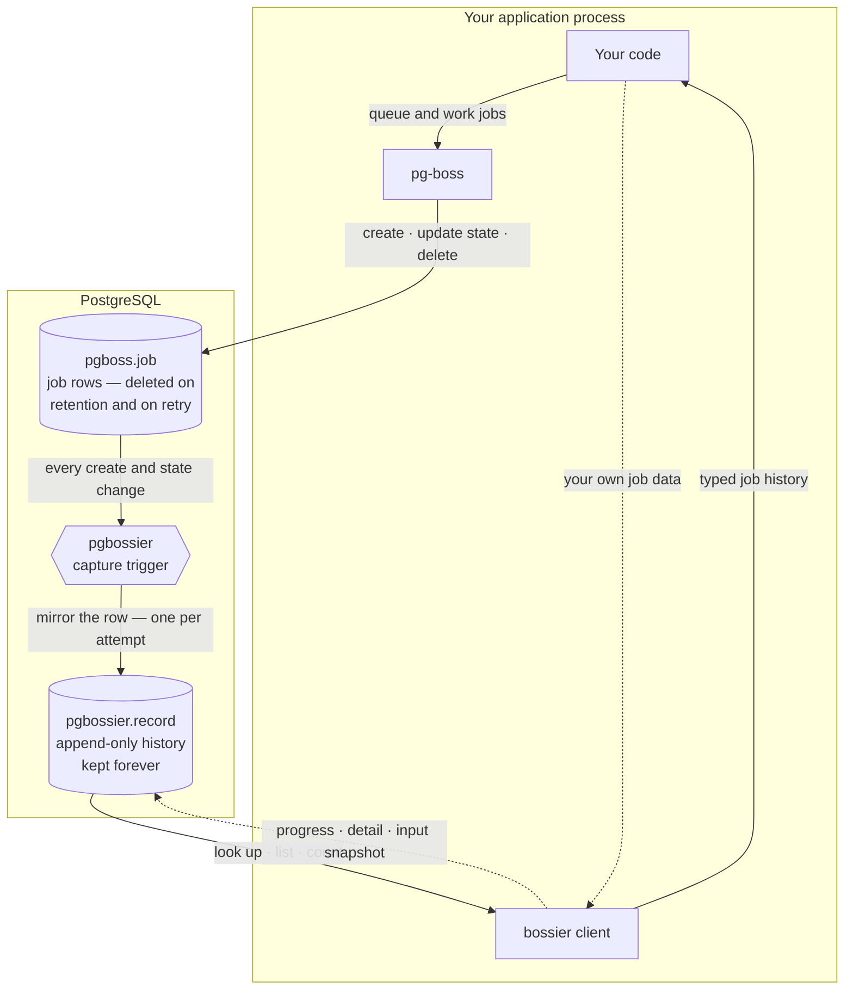

# pg-bossier

[](https://github.com/elfensky/pg-bossier/actions/workflows/ci.yml)

An operational data plane for [pg-boss](https://github.com/timgit/pg-boss) — forensic job history, typed failure detail, retry lineage, mid-job progress, and lifecycle events. pg-bossier **layers on top of** pg-boss: it extends pg-boss, and never replaces it.

> **Status — pre-release.** Not yet published to npm; the package sits at `0.0.0`. Permanent job history and the typed query API work today; typed failure detail, mid-job progress, and lifecycle events are in progress. Per-feature status is in [Features](#features) below; the full scope lives in [issue #1](https://github.com/elfensky/pg-bossier/issues/1).

## Why

pg-boss deletes job rows in place. Once a job finishes and its retention window passes, the row is gone; a retried job is `DELETE`+`INSERT`ed under the same id. That makes "what happened to job X six months ago?" unanswerable. pg-bossier installs one trigger that copies every state transition into an append-only table you own, so the history outlives pg-boss's cleanup.

## Features

pg-bossier is nine concrete capabilities — the goals tracked in [issue #1](https://github.com/elfensky/pg-bossier/issues/1). Status: ✅ available today · 🟡 in progress · ⬜ planned.

| Capability | What you get | Status |
| --- | --- | --- |
| **Permanent job history** | Every job and every state change kept forever — answerable even after pg-boss has deleted the original row. | ✅ |
| **Typed query API** | Typed methods to look jobs up, list and filter them, and count them by state or queue — no hand-written SQL. | ✅ |
| **Retry history** | Every attempt of a retried job preserved as its own record, with one method for the full ordered history. | ✅ |
| **One-step install, clean uninstall** | Adoption is one dependency and one migration; removal drops a single schema and leaves pg-boss untouched. | ✅ |
| **pg-boss compatibility contract** | A documented tier system naming which pg-boss surfaces pg-bossier depends on and how stable each is. | ✅ |
| **Typed failure detail** | A structured, queryable reason for every finished job — with a temporary-vs-permanent label on failures. | 🟡 |
| **Input snapshots** | An optional slot to record what data a job saw when it ran, so its inputs stay recoverable. | 🟡 |
| **Mid-job progress** | A progress value a worker updates while a job runs, surviving crashes and retries. | 🟡 |
| **Lifecycle events** | Subscribe to job state changes as they happen, instead of polling for them. | ⬜ |

🟡 capabilities are partly usable now — the storage that backs them works today, while their typed APIs are still being designed.

## How it works

pg-bossier never sits between your application and pg-boss — you keep calling pg-boss exactly as before. The history is captured inside PostgreSQL itself:



1. **Your app runs jobs through pg-boss as usual.** pg-bossier changes nothing about how you queue or work jobs.
2. **pg-boss manages its own `pgboss.job` table** — creating rows, updating their state, and deleting them once a retention window passes or a retry replaces them.
3. **A capture trigger mirrors every change.** Each time a job is created or changes state, pg-bossier copies that row into its own `pgbossier.record` table — one row per attempt, so retries are preserved rather than overwritten.
4. **The history outlives pg-boss's cleanup.** When pg-boss deletes a job row, `pgbossier.record` is left untouched — the history stays.
5. **You read history through the `bossier` client.** Its query methods only ever read `pgbossier.record`, so they keep answering long after the original `pgboss.job` row is gone.

The capture is fail-open: if it ever errors, the failure is logged and skipped — it never blocks the pg-boss operation that triggered it.

## Requirements

- Node.js ≥ 18
- [pg-boss](https://github.com/timgit/pg-boss) 12 (`^12.18.2`) — peer dependency
- [`pg`](https://node-postgres.com/) 8 (`^8`) — peer dependency
- PostgreSQL, as required by pg-boss 12

## Install

> **Not yet published to npm.** Until the first release, install from GitHub:

```sh
npm install github:elfensky/pg-bossier
```

pg-bossier compiles itself on install (an npm `prepare` hook), so a git install arrives with a ready-to-use `dist/`. Once published, this becomes `npm install pg-bossier`.

`pg-boss` and `pg` are peer dependencies — install them alongside if your project doesn't already depend on them.

## Usage

```ts
import { PgBoss } from 'pg-boss';
import pg from 'pg';
import { install, bossier } from 'pg-bossier';

const connectionString = process.env.DATABASE_URL!;

// 1. One-time install. Creates the `pgbossier` schema, the `record` chronicle
//    table, and a capture trigger on `pgboss.job`, then backfills existing
//    jobs. Idempotent — safe to run on every boot or as a migration step.
const pool = new pg.Pool({ connectionString });
await install(pool);

// 2. Start pg-boss exactly as you already do — pg-bossier changes nothing here.
const boss = new PgBoss(connectionString);
await boss.start();

// 3. Wrap it. `client.boss` is the same pg-boss instance; from here on, every
//    job state transition is mirrored into `pgbossier.record` and kept forever.
const client = bossier({ boss, pool });

await client.boss.createQueue('email');
await client.boss.send('email', { to: 'user@example.com' });
```

### Reading job history

The `bossier` client exposes typed read methods over `pgbossier.record`. Because that table outlives pg-boss's row deletion, they answer operational questions long after the `pgboss.job` row is gone:

```ts
// the latest attempt of one job — null if unknown
const job = await client.findById(jobId);

// every attempt of a retried job, oldest first
const attempts = await client.getRetryHistory(jobId);

// a filtered, paginated page, with an exact total
const { rows, total } = await client.listJobs({
  queue: 'email',
  states: ['failed'],
  limit: 50,
});

// job counts grouped by current state, or by queue
const byState = await client.countByState({ queue: 'email' });
const byQueue = await client.countByQueue();

// the most recently created job in each queue
const latest = await client.latestPerQueue(['email', 'reports']);

// active jobs running longer than a threshold (default 900s)
const stalled = await client.listLongRunning({ longerThanSeconds: 600 });
```

### Writing pg-bossier-owned columns

`recordPatch` writes the columns the capture trigger leaves for the application — `progress`, `terminal_detail`, and `input_snapshot`. It targets a single attempt, keyed by job id and attempt number (pg-boss's `retry_count` — `0` on the first try):

```ts
await client.recordPatch(jobId, 0, { progress: { done: 3, total: 10 } });
```

Values must be valid JSON — objects, arrays, numbers, and booleans. The typed write APIs for these columns land with Goals 2, 4, and 6.

### Uninstall

Removal is symmetric — one statement drops everything pg-bossier created and leaves `pgboss.job` untouched:

```ts
import { uninstall } from 'pg-bossier';

await uninstall(pool); // DROP SCHEMA pgbossier CASCADE
```

## pg-boss compatibility

pg-bossier classifies every pg-boss surface it touches as Stable, Transitional, or Forbidden — see [`COMPATIBILITY.md`](./COMPATIBILITY.md).

## Versioning

[Semantic Versioning](https://semver.org/). While on `0.x` the API is unstable — anything may change between minor versions. Changes are recorded in [`CHANGELOG.md`](./CHANGELOG.md).

## License

[MIT](./LICENSE) © Andrei Lavrenov
