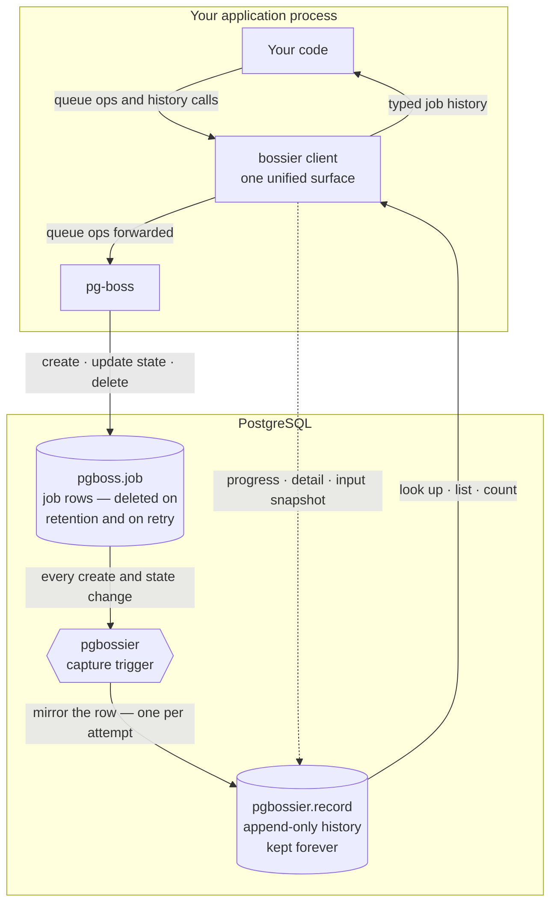

# pg-bossier

[](https://github.com/elfensky/pg-bossier/actions/workflows/ci.yml)

An operational data plane for [pg-boss](https://github.com/timgit/pg-boss) — forensic job history, typed failure detail, retry lineage, mid-job progress, and lifecycle events. pg-bossier **layers on top of** pg-boss: it extends pg-boss, and never replaces it.

> **Status — pre-release.** Tagged `v0.3.1`, **not yet published to npm** (install from a git tag — see [Install](#install)). All nine charter goals are delivered and validated in the descent-app adoption trial. Per-feature status is in [Features](#features) below; the full scope lives in [issue #1](https://github.com/elfensky/pg-bossier/issues/1).

## Why

pg-boss deletes job rows in place. Once a job finishes and its retention window passes, the row is gone; a retried job is `DELETE`+`INSERT`ed under the same id. That makes "what happened to job X six months ago?" unanswerable. pg-bossier installs one trigger that copies every state transition into an append-only table you own, so the history outlives pg-boss's cleanup.

## Features

pg-bossier is nine concrete capabilities — the goals tracked in [issue #1](https://github.com/elfensky/pg-bossier/issues/1). Status: ✅ available today · 🟡 in progress · ⬜ planned.

| Capability | What you get | Status |
| --- | --- | --- |
| **Permanent job history** | Every job and every state change kept forever — answerable even after pg-boss has deleted the original row. | ✅ |
| **Typed query API** | Typed methods to look jobs up, list and filter them, and count them by state or queue — no hand-written SQL. | ✅ |
| **Retry history** | Every attempt of a retried job preserved as its own record, with one method for the full ordered history. | ✅ |
| **One-step install, clean uninstall** | Adoption is one dependency and one migration; removal drops a single schema and leaves pg-boss untouched. | ✅ |
| **pg-boss compatibility contract** | A documented tier system naming which pg-boss surfaces pg-bossier depends on and how stable each is. | ✅ |
| **Typed failure detail** | A structured, queryable reason for every finished job — with a temporary-vs-permanent label on failures. | ✅ |
| **Input snapshots** | An optional slot to record what data a job saw when it ran, so its inputs stay recoverable. | ✅ |
| **Mid-job progress** | A progress value a worker updates while a job runs, surviving crashes and retries. | ✅ |
| **Lifecycle events** | Subscribe to job state changes as they happen (`subscribeEvents`), instead of polling for them. | ✅ |

Plus, since the 2026-06-23 general-purpose reposition (see [CLAUDE.md § General-purpose reposition](./CLAUDE.md)):

| Capability | What you get | Status |
| --- | --- | --- |
| **Bring-your-own connection** | Reads and writes run through pg-boss's own DB handle — no separate `pg.Pool` needed when pg-boss is wired to a Prisma/Knex/Kysely/Drizzle adapter. | ✅ |
| **Live runtime state** | `getLiveState` / `getLiveHeartbeat` read pg-boss's *current* heartbeat / expiry / state without dropping to raw `pgboss.job` SQL. | ✅ |
| **One import for everything** | pg-boss's `PgBoss` class, its ORM adapters and all its types are re-exported from `pg-bossier`, alongside pg-bossier's own API. | ✅ |

## How it works

pg-bossier gives you a single client that wraps pg-boss: you call queue operations on it just as you would on pg-boss, and pg-bossier's own methods sit right alongside them. The job history is captured separately, inside PostgreSQL — by a database trigger, not by the client:


```mermaid
flowchart TD
    subgraph app["Your application process"]
        Code["Your code"]
        Client["bossier client<br/>one unified surface"]
        Boss["pg-boss"]
    end

    subgraph db["PostgreSQL"]
        Job[("pgboss.job<br/>job rows — deleted on<br/>retention and on retry")]
        Trigger{{"pgbossier<br/>capture trigger"}}
        Record[("pgbossier.record<br/>append-only history<br/>kept forever")]
    end

    Code -->|"queue ops and history calls"| Client
    Client -->|"queue ops forwarded"| Boss
    Boss -->|"create · update state · delete"| Job
    Job -->|"every create and state change"| Trigger
    Trigger -->|"mirror the row — one per attempt"| Record
    Record -->|"look up · list · count"| Client
    Client -->|"typed job history"| Code
    Client -.->|"progress · detail · input snapshot"| Record
```

1. **Your app runs jobs through the `bossier` client.** It forwards every pg-boss queue operation to pg-boss unchanged — pg-bossier extends pg-boss's API, it never replaces it.
2. **pg-boss manages its own `pgboss.job` table** — creating rows, updating their state, and deleting them once a retention window passes or a retry replaces them.
3. **A capture trigger snapshots each state transition.** Each time a job is created or **changes state**, pg-bossier copies that row into its own `pgbossier.record` table — one row per attempt, so retries are preserved rather than overwritten. `pgbossier.record` is a **state-transition chronicle, not a live mirror** of `pgboss.job`: the trigger fires on `state` changes only (`AFTER INSERT OR UPDATE OF state`), so interim writes to `pgboss.job.output` and `boss.touch()` heartbeats *between* transitions are **not** captured until the next transition. `output`/`data` therefore reflect the value at the last state change, with final output landing on the terminal transition. For live, mid-flight job progress use [`setProgress`/`getProgress`](#job-progress) (a dedicated out-of-band writer) — do not write to `pgboss.job.output` and expect to read it back from `record` before the job completes. To read the *current* `pgboss.job` row, use [`getLiveState`/`getLiveHeartbeat`](#live-runtime-state).
4. **The history outlives pg-boss's cleanup.** When pg-boss deletes a job row, `pgbossier.record` is left untouched — the history stays.
5. **You read history through the `bossier` client.** Its query methods only ever read `pgbossier.record`, so they keep answering long after the original `pgboss.job` row is gone.

The capture is fail-open: if it ever errors, the failure is logged and skipped — it never blocks the pg-boss operation that triggered it. (A silent drop leaves a gap in `record`; [`captureHealth()`](#capture-health) surfaces it.)

## Requirements

- Node.js ≥ 20.4
- [pg-boss](https://github.com/timgit/pg-boss) 12 (`^12.18.2`) — peer dependency
- [`pg`](https://node-postgres.com/) 8 (`^8`) — peer dependency
- PostgreSQL, as required by pg-boss 12

## Install

pg-bossier is a Postgres add-on to [pg-boss](https://github.com/timgit/pg-boss).
Install it via npm and run the install step once against your database.

### From a git URL (pre-publish)

Until pg-bossier is on npm, install it directly from a tag (use the
latest release):

```bash
npm install 'git+https://github.com/elfensky/pg-bossier.git#v0.3.1'
```

Pin to a tag (or a specific commit SHA) rather than a branch — branch
refs in `package-lock.json` re-resolve to the branch head on every
`npm ci`, which makes builds non-reproducible.

> ⚠️ **Git-URL install requires install scripts to be allowed.** `dist/` is not
> committed; a git dependency builds itself via the `prepare` lifecycle script
> at install time. Under script-blocking installs (`npm ci --ignore-scripts`,
> allow-scripts gating, hardened CI) `prepare` does not run, so `dist/` is never
> produced and `import … from 'pg-bossier'` fails later with a confusing
> "cannot find module `./dist/index.js`". Allow the script for pg-bossier, or
> wait for the npm release (a prebuilt `dist/` ships in the tarball — no
> build-on-install).

### Programmatic install

```ts
import { Pool } from 'pg';
import { install } from 'pg-bossier';

const pool = new Pool({ connectionString: process.env.DATABASE_URL });
await install(pool);  // creates the pgbossier schema, table, trigger, etc.

// Later:
import { uninstall } from 'pg-bossier';
await uninstall(pool);  // DROP SCHEMA pgbossier CASCADE
```

`install()` is idempotent. Run it once at app boot or in a one-shot
migration script.

### Auto-provision at startup

If pg-bossier sits on a critical path (e.g. `setClaim`/`getClaim` for worker auth, or `getProgress`), a forgotten migration is an outage. Opt into provisioning at construction with `autoMigrate` — it runs the idempotent `migrate()` once, mirroring how pg-boss migrates itself at `boss.start()`:

```ts
const client = bossier({ boss, pool, autoMigrate: true });
await client.ensureInstalled(); // optional hard barrier before the first job
```

- `autoMigrate: true` kicks the migration off in the (sync) constructor; `ensureInstalled()` returns the one cached migration promise — `await` it to block until the schema is ready. A *failed* migration isn't cached, so a later `ensureInstalled()` retries.
- Both need a real `pool` (the transactional installer uses `pool.connect()`): `ensureInstalled()` rejects without one, and `autoMigrate: true` throws at construction. Concurrent replicas racing to migrate is safe — a transaction-scoped advisory lock serializes them.
- `await client.isBossierInstalled()` is a cheap probe (named so it doesn't shadow pg-boss's own `isInstalled()`) to gate on at startup. The client's *read* methods are fail-soft if the schema is absent (they return empty + warn once rather than throw), symmetric with the fail-open writes — so a missing migration degrades instead of taking down the request path.

### Upgrading (non-destructive)

To move an already-adopted install to a newer pg-bossier version, call
`migrate(pool)` — **not** `uninstall()` + `install()`:

```ts
import { migrate } from 'pg-bossier';
await migrate(pool); // adds any new columns/indexes in place; keeps all history
```

`migrate()` (and `install()`, which is now equally additive) brings the
`pgbossier.record` table up to the current shape **in place** — `ALTER TABLE …
ADD COLUMN IF NOT EXISTS`, `CREATE/DROP INDEX IF EXISTS`, `CREATE OR REPLACE`
of the capture function/trigger — without touching existing rows. The old
drop+reinstall convention would discard exactly the records that outlived
pg-boss's `deletion_seconds` GC (the only reason to run pg-bossier); `migrate()`
preserves them. Safe to re-run.

### CLI install (optional)

For ops contexts or CI/CD pipelines where wiring a Node script is
awkward:

```bash
npx pg-bossier install   --conn-string="$DATABASE_URL"
npx pg-bossier uninstall --conn-string="$DATABASE_URL"
```

The CLI prints the destination (`host=… database=… schema=…`) before
running any SQL so you can confirm the right database is being changed.

### Schema configuration

By default, pg-bossier installs into the `pgbossier` schema and triggers
on `pgboss.job`. Override either name:

```ts
await install(pool, {
  schema:       'altbossier',     // pg-bossier's own schema
  pgbossSchema: 'altpgboss',      // pg-boss source schema
});
```

The same options propagate to the client:

```ts
const client = bossier({ boss, pool, schema: 'altbossier' });
```

### Prisma coexistence ⚠️

> **⚠️ If you use Prisma with `multiSchema` preview, you MUST exclude
> the `pgbossier` schema from your `datasource.schemas` list.**
>
> `prisma db pull` with `multiSchema` introspects all schemas including
> pgbossier. Running `prisma migrate dev` against the resulting schema
> would try to drop or migrate pg-bossier's tables — destructive
> failure.

For standard (non-`multiSchema`) Prisma usage: `prisma migrate` only
manages schemas declared in your Prisma datasource. pgbossier is not
declared there, so Prisma doesn't see it. `install(pool)` is
idempotent; safe to run on every deploy.

### Supported topologies

| pg-bossier schemas | pg-boss schemas | Status |
|---|---|---|
| 1 | 1 (default) | ✅ Supported (common case) |
| N distinct | N distinct | ✅ Supported (full isolation) |
| 2 distinct | 1 shared | ❌ Unsupported (duplicate captures) |
| 1 | N distinct | ❌ Unsupported (one instance, one source) |

## Usage

```ts
import { PgBoss } from 'pg-boss';
import pg from 'pg';
import { install, bossier } from 'pg-bossier';

const connectionString = process.env.DATABASE_URL!;

// 1. One-time install. Creates the `pgbossier` schema, the `record` chronicle
//    table, and a capture trigger on `pgboss.job`, then backfills existing
//    jobs. Idempotent — safe to run on every boot or as a migration step.
const pool = new pg.Pool({ connectionString });
await install(pool);

// 2. Start pg-boss exactly as you already do — pg-bossier changes nothing here.
const boss = new PgBoss(connectionString);
await boss.start();

// 3. Wrap it. `client` is one surface — every pg-boss method plus pg-bossier's
//    own; from here on, each job state transition is mirrored into
//    `pgbossier.record` and kept forever.
const client = bossier({ boss, pool });

await client.createQueue('email');
await client.send('email', { to: 'user@example.com' });
```

**Bring your own connection.** The `pool` above is **optional** for the client. Omit it and pg-bossier runs its reads and writes through pg-boss's *own* DB handle (`boss.getDb()`) — so when pg-boss is wired to an ORM adapter you never hand pg-bossier a separate `pg.Pool`:

```ts
import { PgBoss, bossier, fromPrisma } from 'pg-bossier'; // everything from one package
const boss = new PgBoss({ db: fromPrisma(prisma) });
await boss.start();
const client = bossier({ boss }); // reads/writes go through Prisma's connection
```

Two paths still need a real connection: `subscribeEvents` (LISTEN/NOTIFY) and `install` / `uninstall` (transactional DDL) — pass a `pool` for those (the CLI installer makes its own).

**One import for everything.** `pg-bossier` re-exports pg-boss's whole surface, so `import { PgBoss, bossier, fromPrisma, getLiveState, type JobWithMetadata } from 'pg-bossier'` all resolve from the one package.

### Live runtime state

`getLiveState(jobId)` reads what pg-boss knows about a job *right now* (heartbeat, expiry, current state) — closing the gap that used to force a raw `pgboss.job` query. It's deliberately **non-forensic**: once pg-boss deletes the row on completion, the live fields are gone (use the history methods below for the durable record). `recordState` lets you tell a finished job from a brief retry transition:

```ts
const live = await client.getLiveState(jobId);
if (live?.livePresent) {
  console.log('last heartbeat:', live.job!.heartbeatOn);
} else if (live && ['active', 'retry', 'created'].includes(live.recordState ?? '')) {
  // No live row, but the record says it's mid-flight — a brief retry DELETE+INSERT
  // gap, not "gone". Don't render "not found".
} // else: genuinely done (completed/failed/cancelled), or unknown (live === null)

const beat = await client.getLiveHeartbeat(jobId); // Date | null
```

**A captured record is required.** `getLiveState` resolves the job's queue from `pgbossier.record` (to scope the read to one `pgboss.job` partition), so a job pg-bossier never captured returns `null` **even if a live `pgboss.job` row exists right now** — e.g. a job enqueued *before* `install()`, or one lost to a fail-open capture gap. `getLiveHeartbeat` (which delegates) returns `null` in the same cases. This is "unknown to pg-bossier", not necessarily "no live row".

**Batched reads.** For a dashboard listing many jobs, `getLiveHeartbeats(ids)` reads every job's live heartbeat in one query (a `Map` keyed by every requested id) instead of an N+1 loop of per-row `getLiveHeartbeat`:

```ts
const { rows } = await client.listJobs({ states: ['active'] });
const beats = await client.getLiveHeartbeats(rows.map((r) => r.jobId));
// beats.get(id) -> Date | null   (null = no live row / no heartbeat yet)
```

### Reading job history

The `bossier` client exposes typed read methods over `pgbossier.record`. Because that table outlives pg-boss's row deletion, they answer operational questions long after the `pgboss.job` row is gone:

> **Replacing raw `pgboss.job` queries?** These methods cover the common read patterns — by-id lookup, paginated/filtered lists, latest-per-queue, and state/queue counts (with `{ live: true }` for live `pgboss.job` depth, or a `completedAfter` window for rolling failure counts). The few operations that stay raw by design are the live `pgboss.job.output` writes (`complete`/queue ops, which pg-bossier extends rather than replaces).

```ts
// the latest attempt of one job — null if unknown
const job = await client.findById(jobId);

// every attempt of a retried job, oldest first
const attempts = await client.getRetryHistory(jobId);

// a filtered, paginated page, with an exact total
const { rows, total } = await client.listJobs({
  queue: 'email',
  states: ['failed'],
  limit: 50,
});

// job counts grouped by current state, or by queue
const byState = await client.countByState({ queue: 'email' });
const byQueue = await client.countByQueue();

// the most recently created job in each queue
const latest = await client.latestPerQueue(['email', 'reports']);

// active jobs running longer than a threshold (default 900s)
const stalled = await client.listLongRunning({ longerThanSeconds: 600 });
```

> **`countByState`/`countByQueue` are all-time by default.** They count the chronicle's current-attempt-per-job view, which **retains jobs pg-boss has already deleted** — so the totals are a forensic **superset** of live `pgboss.job` queue depth and grow unbounded over time. That is correct for "how many jobs of each state have ever existed", but **not** a drop-in replacement for a live-queue-depth dashboard. For a live count, pass `{ live: true }` (counts `pgboss.job` directly); for a recent window, constrain with `createdAfter` / `completedAfter`:
>
> ```ts
> const allTime = await client.countByState({ queue: 'email' });            // chronicle (superset)
> const liveNow = await client.countByState({ queue: 'email', live: true }); // live pgboss.job depth
> ```

### Capture health

Capture is fail-open: a failing trigger logs a Postgres `WARNING` and leaves a gap in `pgbossier.record`, with no app-level signal. `captureHealth()` makes that drift observable — chronicle freshness plus a bounded coverage check:

```ts
const h = await client.captureHealth();
// { lastCapturedSeq, lastCapturedAt,  // freshness — alarm if stale on a busy queue
//   checked, missing }                // of the N most-recent live jobs, how many lack a record
if (h.missing > 0) alert('capture dropped rows');
```

The coverage check looks at the most-recent live jobs (default 1000, `{ sampleLimit }` to widen). It is **not an O(1) probe** — finding the most-recent N means an `ORDER BY created_on DESC LIMIT` over `pgboss.job`, which scans/sorts proportional to the live-job count on a large queue (`sampleLimit` bounds the result, not the scan). **Run it periodically (cron / an admin health job), not on a hot per-request path.** The freshness half (`lastCapturedSeq`/`lastCapturedAt`) is cheap; the coverage half is the expensive one. Observability only — it never changes capture behaviour, which stays fail-open.

For cheap frequent polling, pass `{ coverage: false }` to run only the freshness query and skip the coverage scan entirely; `checked` / `missing` come back `null` (distinguishable from a genuine `0`). When pg-bossier isn't installed, **all four fields are `null`** — distinct from an installed-but-empty `{ …, checked: 0, missing: 0 }` — so guard `missing` (e.g. `if (h.missing && h.missing > 0)`) before alarming.

### Writing pg-bossier-owned columns

The capture trigger mirrors pg-boss's columns; the columns it leaves for the application each have their own dedicated, validated writer, keyed to a single attempt by job id and attempt number (pg-boss's `retry_count` — `0` on the first try):

- `input_snapshot` → `recordInputSnapshot` — see [Recording input snapshots](#recording-input-snapshots).
- `terminal_detail` → `recordTerminalDetail` — see [Recording terminal detail](#recording-terminal-detail).
- `progress` → `setProgress` — see [Job progress](#job-progress).

### Recording terminal detail

After a worker finishes a job, pg-bossier lets you classify the outcome with structured detail. The `recordTerminalDetail` method writes a typed shape into the audit row's `terminal_detail` JSONB column.

```ts
import { bossier } from 'pg-bossier';
const client = bossier({ boss, pool });

// Inside a worker handler:
try {
  // ... do work ...
  await boss.complete(jobId, output);
  await client.recordTerminalDetail(jobId, attempt, {
    state: 'completed',
    detail: { duration_ms: 42 },
  });
} catch (err) {
  await boss.fail(jobId, err);
  await client.recordTerminalDetail(jobId, attempt, {
    state: 'failed',
    detail: {
      class: isRateLimit(err) ? 'transient' : 'non_retryable',
      message: String(err),
    },
  });
}
```

#### Shape

`terminal_detail` is discriminated by row `state`:

- `state: 'failed'` → `{ class: 'transient' | 'non_retryable', message?, where?, ...anything else }`. The `class` field is required. If you don't know, default to `'non_retryable'` (conservative: gives up rather than spinning) and put the reason in `message`.
- `state: 'cancelled'` → `{ cancelledBy?, reason? }` (open).
- `state: 'completed'` → any plain object (no shape enforcement).

#### Retry interaction

If pg-boss is going to retry the job, the row at `(jobId, attempt)` transitions through `state='retry'`. `recordTerminalDetail` writes `state: 'failed'` regardless — the SQL writer maps `'failed'` to the allowed row states `['failed', 'retry']`. The detail stays attached to the original attempt's chronicle row.

### Recording dead-letter lineage

When pg-boss exhausts a job's retries, it routes the failure to a separate dead-letter queue (DLQ) — a fresh job with a new id and no link back to the source. Once the source's `pgboss.job` row is gone, the DLQ entry is an orphan. pg-bossier closes that gap with one call: from your DLQ handler, record the source→DLQ link, and you can reach the full source history from a DLQ id forever after.

pg-bossier cannot derive the source id from the DLQ job — pg-boss does not carry it forward. Establishing the link is a cooperative effort: the consumer preserves the source id on its own data; pg-bossier persists the link and exposes both directions of lookup.

#### The `_originalJobId` consumer contract

The link has two halves, and both must be in place **when you `boss.send()`** the source job:

1. **Set the source job's id explicitly** so it equals your self-identifying id. pg-bossier's chronicle keys each row on pg-boss's *actual* job id, so `recordDeadLetter`'s `sourceJobId` must be that id — not a separate value. Pass it via `send`'s `id` option.
2. **Carry the same id on the job's `data`** (e.g. `_originalJobId`). pg-boss copies the source job's `data` into the dead-letter job, so this is how the DLQ handler recovers the source id — the DLQ job itself has a *new* id.

```ts
// when sending the original job
const sourceId = crypto.randomUUID();
await boss.send(
  'image-processing',
  { _originalJobId: sourceId, url: 'https://example.com/photo.jpg' }, // copied into the DLQ job
  { id: sourceId },                                                    // becomes the job's actual id
);
```

**`sendTracked` does both halves in one call** so they can't drift apart (the silent failure mode above). It pins the id and stamps `data._originalJobId` to the same value, returning the id (or `null` if a singleton policy deduped the send):

```ts
const sourceId = await client.sendTracked(
  'image-processing',
  { url: 'https://example.com/photo.jpg' }, // _originalJobId is added for you
);
// pass an explicit { id } to pin a known id; otherwise one is generated.
```

Then, in the DLQ handler, the copied field is what you hand to `recordDeadLetter`:

```ts
boss.work('image-processing.dlq', async (job) => {
  await client.recordDeadLetter({
    sourceJobId: job.data._originalJobId,  // == the source job's real id (set via `id` above)
    dlqJobId: job.id,
  });
  // ...your DLQ-specific recovery logic...
});
```

This is a **named, surface-level requirement**, not a buried convention. If the self-identifying id is only in `data` but is *not* the source job's actual id (you skipped the `id` option), `recordDeadLetter` finds no matching chronicle row and silently no-ops with a `reason: 'not_found'` warning — the lineage never records. Use any field name you like for the data half; `_originalJobId` is just the convention this README uses.

#### Round-trip example

```ts
// 1. Send the source job, self-identifying: the id IS the job's id (so the
//    chronicle keys on it) and rides in data (so the DLQ copy carries it).
const sourceId = crypto.randomUUID();
await boss.send('image-processing', { _originalJobId: sourceId, url: '...' }, { id: sourceId });

// 2. The worker runs and fails terminally. The capture trigger writes the
//    source's chronicle row with state='failed'. pg-boss routes a fresh job
//    into the DLQ.

// 3. The DLQ handler picks up the DLQ job and records the link.
boss.work('image-processing.dlq', async (job) => {
  await client.recordDeadLetter({
    sourceJobId: job.data._originalJobId,
    dlqJobId: job.id,
  });
});

// 4. Later, in a forensic UI: reach the source from a DLQ id.
const source = await client.findDeadLetterSource(dlqJobId);
// → { jobId: '<sourceId>', attempt: <n>, queue: 'image-processing' }
//   or null if no link was recorded.
const history = await client.getRetryHistory(source.jobId);
// every attempt of the source, including inputs, outputs, terminal_detail.

// 5. Forward direction (source → DLQ).
const target = await client.findDeadLetterTarget(sourceId);
// → { dlqJobId: '<id>', attempt: <n> } or null.
```

#### Idempotency contract

Calling `recordDeadLetter` twice with the same `(sourceJobId, dlqJobId)` is idempotent — the same merged value lands on the source's row. Calling with a *different* `dlqJobId` for the same source is a no-op — the first link wins, and a warning is logged. This prevents a buggy handler that regenerates DLQ ids on retry from silently overwriting an established link.

If the source has no `failed` row at all (wrong id, never reached `failed`, source row purged), the call is also a silent no-op with a warning log carrying `reason: 'not_found'`.

#### Composition with `recordTerminalDetail`

`recordDeadLetter` and Goal 2's `recordTerminalDetail` cooperate at the key level inside the `terminal_detail` JSONB column. Either call order produces the merged shape `{ class, message, deadLetteredAs, ... }` — the writers JSONB-merge into the same row, so neither one wipes out the other's fields.

#### When to call it

`recordDeadLetter` only writes when the source's most-recent chronicle row is in `state = 'failed'`. It silently no-ops if the source is still in `state = 'retry'` between attempts — call it from the DLQ-handler (which runs *after* pg-boss has committed the terminal failure), not from a mid-retry worker callback. The DLQ handler is the only place that has both the source id (from `_originalJobId`) and the DLQ id (from `job.id`) at the same time anyway.

#### What does NOT change

- **`progress` (Goal 6) is not copied source → DLQ.** The DLQ job starts with no progress; its chronicle entries are its own. The source job's `progress` history stays on the source's rows and is reachable through `findDeadLetterSource` + `getProgress`.
- **`boss.retry(dlqJobId)` (the SQS-redrive analogue) does not disturb the existing `deadLetteredAs` link.** The DLQ job gets a new attempt; its `pgbossier.record` row gets a new attempt row via the capture trigger; the existing link on the *source* job's row is unaffected.

### Recording input snapshots

A job's `data` payload is what the producer queued. That is not always what the worker actually processed: many jobs go fetch additional state from somewhere else (an HTTP API, another database, the filesystem) at the moment they start, and the meaningful "input" to the run is that fetched state — not the original payload. Once the external source has moved on, the row in `pgboss.job` is deleted, and the worker process is long gone, that information is unrecoverable. The input-snapshot slot is an opt-in JSONB column on `pgbossier.record` for the worker to write a snapshot of what it saw, keyed by `(jobId, attempt)`, so months later you can answer "what data did this job actually process?"

#### ⚠️ Call at job-START, not job-FINISH

`recordInputSnapshot` is for **inputs**, not outputs. Call it at the top of the worker handler — right after you fetch the external state and before you start processing — so the snapshot records what the job *saw on the way in*. If you call it at the end with computed results, you have destroyed the feature: you are recording the output as if it were the input, and the audit trail is wrong in a way that is hard to detect later.

For outputs, use pg-boss's existing `boss.complete(jobId, output)` — pg-boss persists outputs to `pgboss.job.output`, and the capture trigger mirrors that into `pgbossier.record.output` for you.

#### Worker-side example

```ts
boss.work('space-track-fetch', async (job) => {
  // 1. Fetch the external state this attempt will operate on.
  const snapshot = await spaceTrack.fetch({
    catalogId: job.data.catalogId,
    epoch: job.data.epoch,
  });

  // 2. Record it as the input snapshot for THIS attempt. attempt is
  //    pg-boss's retry_count — 0 on the first try.
  await client.recordInputSnapshot(job.id, job.retryCount, snapshot);

  // 3. Do the work using the snapshot. If this attempt fails and pg-boss
  //    retries, the next attempt fetches a fresh snapshot and records its
  //    own — both stay in the audit trail under the same job id.
  const result = await process(snapshot);
  await boss.complete(job.id, result);
});
```

#### Reader: two modes

Read by `(jobId, attempt)` for a specific attempt, or by `jobId` alone for the most-recent non-null snapshot across attempts. The two modes return different shapes:

```ts
// Explicit attempt — returns T | null.
const snap = await client.getInputSnapshot<SpaceTrackPayload>(jobId, 0);
// → the snapshot value, or null if that (jobId, attempt) has no snapshot.

// Most-recent across attempts — returns { snapshot, attempt } | null.
const result = await client.getInputSnapshot<SpaceTrackPayload>(jobId);
// → { snapshot: <value>, attempt: 2 }
//   or null if the job has no snapshot on any attempt.
```

The exported type is `InputSnapshotResult<T>`:

```ts
import type { InputSnapshotResult } from 'pg-bossier';
// { snapshot: T; attempt: number }
```

#### Size

The column is unbounded. PostgreSQL TOASTs large JSONB transparently, so a one-megabyte snapshot is mechanically fine — but `pgbossier.record` grows forever, and unbounded snapshots multiply your storage cost (≈$0.10/GB/month on most cloud providers), make `findById` projections heavier than they would otherwise be, and bloat backups. Snapshot what is forensically useful, not the whole upstream response. Compression is consumer-owned (TOAST handles large values; pg-bossier does not pre-compress).

#### What does NOT change

- **The capture trigger is unchanged.** It has never touched `input_snapshot` (the column is pgbossier-owned, not pg-boss-mirrored) and that stays true.

### Job progress

`setProgress` writes a job's current progress to its active attempt. A worker only needs `job.id` — the target attempt is resolved server-side. Pass any JSON-serializable value: a structured object, a bare string, a number. The call is fail-open: a runtime error logs a warning and resolves without throwing, so a failed progress write never fails the consumer's job. Progress values survive pg-boss retries — each attempt has its own row, so a prior attempt's final checkpoint remains readable even after the job has been retried.

```ts
// inside a pg-boss work() handler
await client.setProgress(job.id, { processed: 1200, total: 5000 });
```

`getProgress` returns the most-recent non-null progress value across all attempts, plus the attempt it came from. Returns `null` if the job is unknown or no attempt has written progress yet.

```ts
const result = await client.getProgress(jobId);
// { progress: { processed: 1200, total: 5000 }, attempt: 0 }
// or null

// typed variant
const typed = await client.getProgress<{ processed: number; total: number }>(jobId);
```

The returned `attempt` is useful for the resumable-job pattern: a new attempt's row starts `null`, so if `getProgress` returns a value whose `attempt` is lower than the current attempt, it is a prior attempt's final checkpoint to resume from. A display-only job can ignore the `attempt` field.

> **Resuming after a retry — the recommended pattern.** pg-boss treats a retry as a *restart*: its `DELETE`+`INSERT` retry path does not carry a job's mid-flight state forward, so progress kept in pg-boss's own row (e.g. writing to `pgboss.job.output`) is not reliably available to the next attempt. pg-bossier's `progress` slot lives in `pgbossier.record`, which the retry never touches — so the resume pattern is entirely pg-bossier-side and **does not use any pg-boss field**:
>
> ```ts
> async function handler(job) {
>   // At the top of the handler: pick up where a prior attempt left off.
>   const prior = await client.getProgress<{ processed: number }>(job.id);
>   let processed = prior?.progress.processed ?? 0;
>
>   for (; processed < total; processed++) {
>     await doWork(processed);
>     await client.setProgress(job.id, { processed }); // high-water mark
>   }
> }
> ```
>
> You only ever store the latest position (the high-water mark), never every intermediate step — on failure you resume from it, on success `started_on`/`completed_on` give you the timing. A full per-step history, if a consumer needs one, is domain detail for the consumer's own store, not pg-bossier.

The exported type is `ProgressResult<TProgress>`:

```ts
import type { ProgressResult } from 'pg-bossier';
// { progress: TProgress; attempt: number }
```

### Job claim owner

`setClaim` claims *a job's current attempt* for a worker — e.g. an external pull-worker that fetched it — as a **compare-and-set**: it writes `claimed_by` only if the current attempt is unclaimed or already owned by the same worker, and returns whether that worker holds the claim afterwards. Two workers racing to claim the same attempt → exactly one gets `true`; it's idempotent for the owner (re-asserting your own claim returns `true`). So a pull-worker can treat the marker as authoritative without relying on pg-boss's `fetch()` to serialize claimants. Like `setProgress`, the target attempt is resolved server-side (a worker needs only `job.id`), it's per-attempt (a retry's owner is recorded separately), and it's fail-open (a DB error warns and returns `false`; a missing install is a quiet `false`). It throws only if `ownerId` is not a non-empty string.

```ts
if (await client.setClaim(job.id, workerId)) {
  // won (or already own it) → safe to process
} else {
  // lost the claim to another worker (or job unknown / not installed) → skip
}
```

`getClaim` returns the `claimed_by` of the job's **current** (latest) attempt — matching where `setClaim` writes — or `null` if the current attempt was never claimed (or the job is unknown). It is current-attempt-scoped on purpose: a pull-worker architecture can use it to authorize a later progress/complete/fail call without a stale owner from a prior failed/retried attempt satisfying the check (a fresh retry attempt reads back as unclaimed until its worker calls `setClaim`).

```ts
const owner = await client.getClaim(jobId); // 'worker-7' | null
if (owner !== requestingWorkerId) throw new Error('not your job');
```

Unlike `progress` (a JSON value), `claimed_by` is a plain `text` owner id — a small, indexed-friendly column distinct from the progress slot, so ownership and progress never compete for the same field.

### Lifecycle events (Goal 7)

Subscribe to job state transitions instead of polling. The method is `subscribeEvents()` — named so it never shadows pg-boss's own pub/sub `subscribe(event, name)`, which stays reachable on the same client. It requires a `pool` (LISTEN/NOTIFY needs a dedicated connection):

```ts
import { bossier } from 'pg-bossier';

const client = bossier({ boss, pool });        // `pool` required for events
const events = await client.subscribeEvents();
let lastSeq = 0n;

events.on('connected', () => console.log('event stream live'));
events.on('failed', e => console.warn(`job ${e.jobId} failed on attempt ${e.attempt}`));
events.on('job', e => { lastSeq = e.seq; });
events.on('error', async e => {
  if (e.reason === 'gap') {
    const missed = await client.getEventsSince(lastSeq);
    for (const row of missed) { lastSeq = row.seq; handleCatchUp(row); }
  }
});

process.on('SIGINT', async () => {
  await events.close();
  await boss.stop();
});
```

**Event types.** `'created'`, `'started'`, `'completed'`, `'failed'`, `'cancelled'`, `'retried'`. Catch-all `'job'`. Subscriber-level `'connected'` (every successful LISTEN), `'warning'` (first occurrence of an unknown pg-boss state), `'error'` (`reason: 'gap' | 'parse' | 'handler'`).

**Delivery contract.** At most once. On a connection drop the subscriber auto-reconnects with exponential backoff + jitter and emits `'error'` with `reason: 'gap'`. Durable replay via `getEventsSince(seq)`. **Important scope:** the audit table holds the final state per attempt, not the full transition sequence within an attempt — `getEventsSince` recovers latest-state-per-attempt only.

**`attempt` semantics.** `created` carries `0` for a freshly-sent job. `started`/`completed`/`failed`/`cancelled` carry the attempt number that was active when the transition happened. `retried` fires when an attempt fails but a retry remains — it carries the FAILING attempt's number (the OLD one). The NEXT attempt's `started` event carries the new attempt number (e.g. `1`). **No `'created'` event fires for retried attempts** — pg-boss's `fetchNextJob` bumps `retry_count` and sets `state='active'` in a single UPDATE, so the retry row goes directly to `started(N+1)`.

For a job that fails once and then succeeds (retryLimit = 1), the consumer sees five events:
`created(0)` → `started(0)` → `retried(0)` → `started(1)` → `completed(1)`.

**Connection cost.** Each live subscriber holds one dedicated pool connection. Size your pool accordingly. For long-running processes only (web servers, workers) — not lambdas / FaaS.

**Unsupported topologies.** PgBouncer in transaction-pool mode silently breaks `LISTEN`. Use session-pool mode, a direct Postgres connection, or skip PgBouncer for the subscriber's connection. See [`COMPATIBILITY.md`](./COMPATIBILITY.md).

**MaxListenersExceededWarning.** If you add many `'job'` listeners (e.g. for metrics fan-out), call `events.setMaxListeners(0)` to suppress Node's 10-listener default warning.

### Retention

The `pgbossier.record` chronicle is append/upsert-only and intentionally outlives pg-boss's GC — that durability is the point. pg-bossier never prunes on its own (no scheduler, no TTL); *you* decide when to trim, with the `prune()` primitive so you don't hand-write `DELETE`s against the internal schema:

```ts
// keep 90 days of done jobs
await client.prune({ olderThan: new Date(Date.now() - 90 * 864e5) });
// or keep the 500 most-recently-completed per queue
const { deleted } = await client.prune({ keepLastPerQueue: 500 });
```

It only ever deletes **fully-done** jobs (current attempt `completed`/`failed`/`cancelled`) and deletes them whole (all attempts); an **in-flight job is never touched**. At least one bound is required (a no-arg call throws rather than wipe everything); with both, a job must violate both to be deleted. Returns `{ deleted }` (rows removed). Not fail-open — it's an explicit maintenance call, so errors propagate; best run during a quiet window (see the `prune` JSDoc).

### Uninstall

Removal is symmetric — one statement drops everything pg-bossier created and leaves `pgboss.job` untouched:

```ts
import { uninstall } from 'pg-bossier';

await uninstall(pool); // DROP SCHEMA pgbossier CASCADE
```

## pg-boss compatibility

pg-bossier classifies every pg-boss surface it touches as Stable, Transitional, or Forbidden — see [`COMPATIBILITY.md`](./COMPATIBILITY.md).

## Versioning

[Semantic Versioning](https://semver.org/). While on `0.x` the API is unstable — anything may change between minor versions. Changes are recorded in [`CHANGELOG.md`](./CHANGELOG.md).

## License

[MIT](./LICENSE) © Andrei Lavrenov
